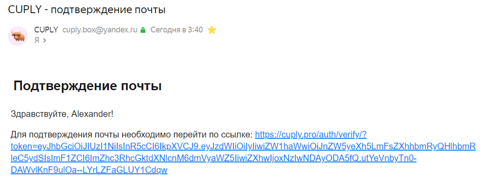
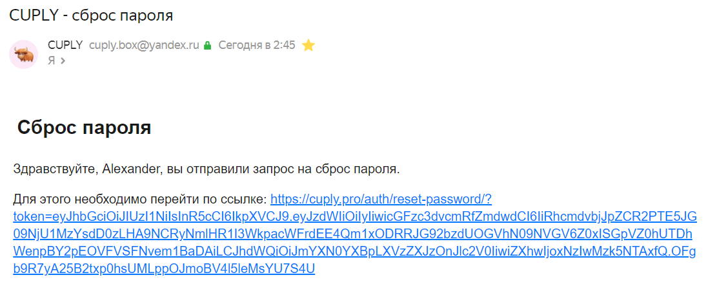

# back

Бэкенд репозиторий проекта

## Миграции
Для генерации миграции нужно выполнить (`change_comment` - будет отображаться
в названии файла с миграцией): 
```bash
source ./tmp/set_prod_env_for_migrations.sh  && ./migration/prod_generate_migration.sh change_comment
```
или
```bash
./migration/prod_generate_migration.sh change_comment
```
Для накатывания миграции нужно выполнить: 
```bash
source ../tmp/set_prod_env_for_migrations.sh  && ./migration/prod_apply_migration.sh
source ../tmp/set_local_env_for_migrations.sh  && ./migration/local_apply_migration.sh
```

## Регистрация
Пример данных для регистрации `/api/v1/auth/register`: 
```json
{
  "email": "user@example.com",
  "password": "pass1234",
  "name": "Alexander",
  "surname": "Kr",
  "birth_date": "02.05.2023",
  "username": "user1"
}
```
Получить токен `/api/v1/auth/jwt/login`:
```json
{
  "username": "user@example.com", email!!!!
  "password": "pass1234"
}
```


## Подтверждение почты/пользователя
1. Отправляется запрос на `/api/v1/auth/request-verify-token`:
```json
{
  "email": "user@example.com"
}
```
2. На почту приходит такое письмо (время жизни токена для подтверждения - 1 час):

3. Отправляется запрос на `/api/v1/verify`:
```json
{
  "token": "token_from_message_param"
}
```

## Сброс пароля
1. Отправляется запрос на `/api/v1/auth/forgot-password`:
```json
{
  "email": "user@example.com"
}
```
2. На почту приходит такое письмо (время жизни токена для сброса - 1 час):

3. Пользователь на фронте вводит новый пароль
4. Отправляется запрос на `/api/v1/auth/reset-password`:
```json
{
  "token": "token_from_message_param",
  "password": "new_user_password"
}
```

## Обновление пароля
Обновление пароля доступно только активным и верифицированным пользователям.
1. Отправляется запрос на `/api/v1/users/{id}/password`:


## Запуск
### Через docker compose
Должны быть прописаны переменные среды в файле `.env` по аналогии
с файлом `.example.env`

Если работает docker compose на сервисе для деплоя, то можно запустить так:
```bash
docker compose up --build
```

### Без docker compose
Если не работает docker compose, то 
1. Создать образ командой:
```bash
docker build . -t cuply_app:latest
```
2. Раскомментировать последнюю строку с CMD в Dockerfile
3. Запустить контейнер (должно отработать, если прокинуты переменные среды):
```bash
docker run -d -p 8080:8000 cuply_app
```

### Проверка
- Для проверки работоспособности приложения дернуть эндпоинт `api/v1/health`
- Для проверки работоспособности базы данных дернуть эндпоинт `api/v1/db_health`

### Разное
- В скриптах в папке docker важно в начале файла указывать `#!/bin/sh`,
так как в alpine образе нет bash по умолчанию
- Для полного удаления нужно выполнять `docker compose down`


## Аутентификация
Делал по этой инструкции из [доки fastapi](https://fastapi.tiangolo.com/tutorial/security/oauth2-jwt/)
Для генерации секретного ключа нужно выполнить команду:
```bash
openssl rand -hex 32
```
